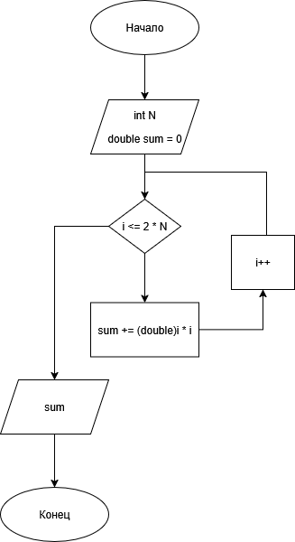

# Домашнее задание к работе 8

## Условие задачи
Написать программу, которая для целого числа N, введённого пользователем, вычисляет вещественное значение суммы квадратов чисел от N до 2·N включительно: N^2+(N+1)^2+(N+2)^2+...+(2N)^2

## 1. Алгоритм и блок-схема

### Алгоритм
1. **Начало**
2. Ввести целое число N
3. Инициализировать переменную sum = 0
4. Организовать цикл от i = N до i = 2 * N
5. На каждом шаге цикла прибавлять к sum значение i * i
6. После завершения цикла вывести значение суммы
7. **Конец**

### Блок-схема


https://github.com/DragonSov/lab8_homework/blob/master/schema.png

## 2. Реализация программы

```c
#include <stdio.h>
#include <locale.h>

int main() {
    setlocale(LC_CTYPE, "RUS");

    int N;
    double sum = 0;

    printf("Введите N: ");
    scanf("%d", &N);

    for (int i = N; i <= 2 * N; i++) {
        sum += i * i;
    }

    printf("Сумма квадратов от N до 2N: %.2f\n", sum);

    return 0;
}
```

## 3. Результаты работы программы


## 4. Информация о разработчике
Попов Станислав, бИПТ-252
```